<table width="100%">
  <tr>
    <td width="55%" valign="top">
      
    </td>
    <td width="45%" valign="top">
      <h3>Public Projects</h3>
      <ul>
        <li><a href="https://github.com/jn-s3s/continue-config"><strong>continue-config</strong></a>       Auto-generated, curated model configs for the Continue VS Code extension (LLM's Provider: Groq, SambaNova, OpenRouter, Gemini)</li>
      </ul>
    </td>
  </tr>
</table>

<table width="100%">
  <tr>
    <td width="55%" valign="top">
      
      
    </td>
    <td width="45%" valign="top">
      
    </td>
  </tr>
</table>
